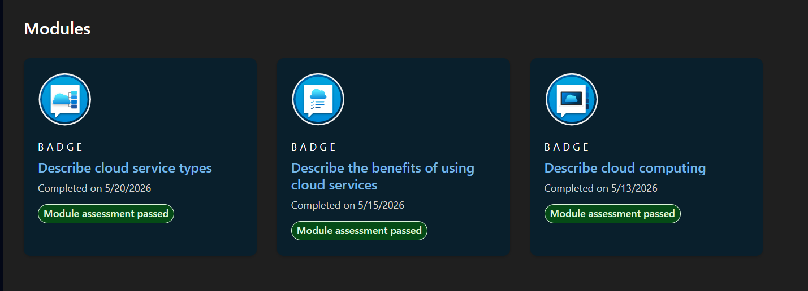
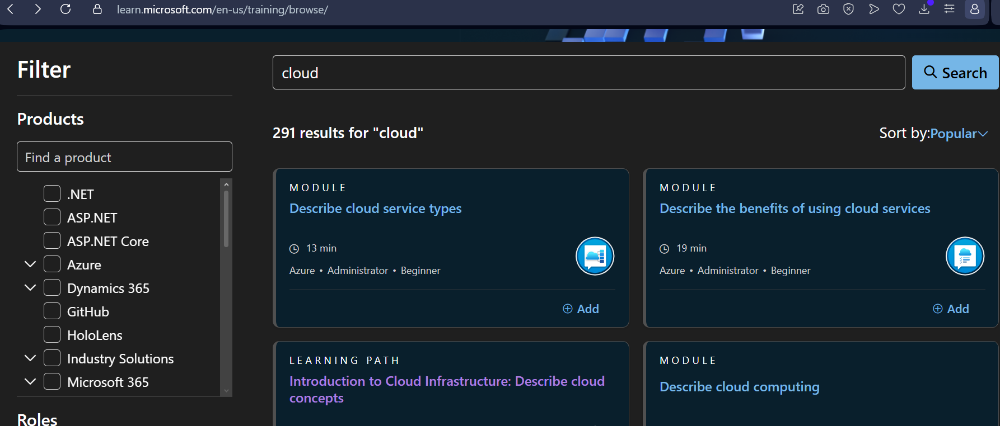

---

## ☁️ Wait, do you even know what "the cloud" is?

What is up, you little bitch. I know you're broke and stupid, we can for now just avert one of those, and bypass the other. Your ignorance about what cloud actually **is** can be fixed, and for free:

🔗 **[learn.microsoft.com/en-us/training/browse/?terms=cloud](https://learn.microsoft.com/en-us/training/browse/?terms=cloud)**

Go through all 4. It should take about 40 minutes to go through everything — a bit more for you, since you're slow as fuck.

This will teach you about:
- What **cloud** actually is
- The **shared responsibility model**
- **IaaS vs PaaS** (Infrastructure as a Service vs Platform as a Service)
- **Scaling**
- **Paying for what you use**
- **Load balancers**, etc.

And I know you don't wanna follow a link, why didn't he just tell me? Don't be a bitch, okay. **Go fetch!**

By the end, you get these (FYI: these are worth nothing to a recruiter):

