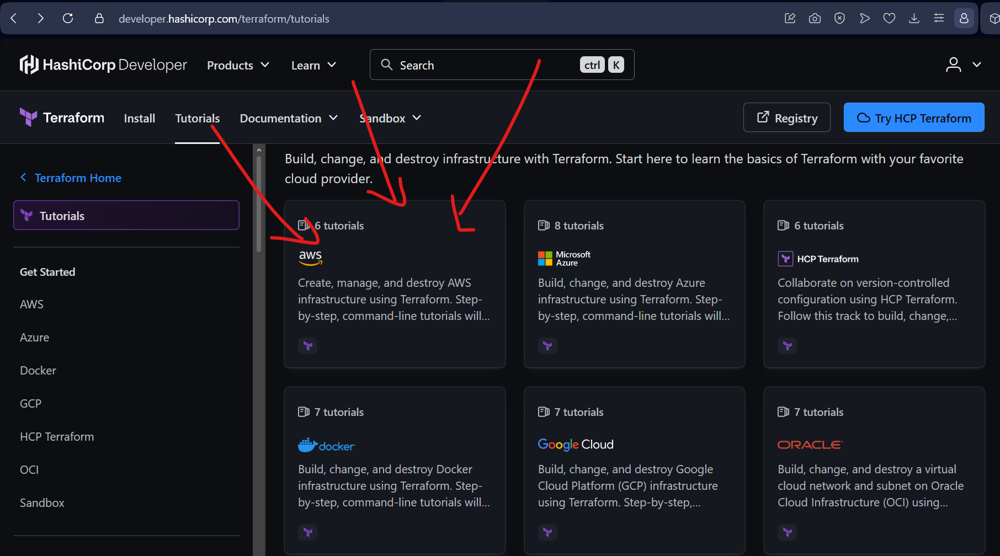

# Terraform 101 (from someone who's been through it)

## What even is Terraform?

Terraform is basically a tool that allows **IaC**, which stands for **Infrastructure as Code**. It allows us to define and manage cloud infrastructure using code rather than the graphical user interface.

So basically, instead of logging into let's say the AWS cloud website and then clicking buttons to create servers, databases, and networks — you write a configuration file describing what you want, and then Terraform builds it for you.

Now I know what you're thinking, I thought the same: *"Why the hell must I learn yet another damn language, why can't I just click buttons? Seems easier, no?"*

## Why bother?

It all comes down to **saving time** — saving time building, saving time fixing, saving time auditing.

How, you ask? Good question, dumbass.

### 🔁 Version Control
Ever heard of Git? It basically tracks shit: every change is reviewed, documented, and easily reversible. You make a change, don't like it? Roll right back. And since you typed it, you also know exactly what you did, even a month later.

But on the other hand, GUI? Well, nobody is tracking your clicks. So if something breaks, have fun opening tabs.

### 🧬 Instant Replica
If I, as your boss (let's face it, I *ordered* you), told you to build me a cloud environment — what's in it, I leave to your imagination, but imagine it being painfully complex: tons of EC2s, S3, IAM roles and policies, blah blah blah.

You spend a bunch of days building it. But since you're a script kiddie, or in my language, a bitch, you used the GUI. But since you're a good egg, you actually built it.

Then you came running to me: *"Daddy, daddy, look, I did it!"* And just like your actual father who left you when you were an infant, I don't show any appreciation. Instead, I tell you to build **exactly the same thing** for the Staging environment as you did for Production.

Now you have to do all the clicks again. But you don't even remember what you did the first time, so you spend hours rebuilding it. If you had written it via Terraform, you just change a variable or two, run the code again, and in 2 minutes... **boom.** You got another one.

### 🛠️ Disaster Recovery
If your infrastructure gets deleted or compromised, your code acts as a blueprint to rebuild the entire system instantly. Rebuilding via GUI relies on memory or outdated wikis.

### 📈 Error-Free Scale
Deploying 50 identical servers via code takes the same effort as deploying one. Manual GUI clicking is slow and guarantees human error — like forgetting to check a security box on the 40th server.

---

## Where to start

There are other tools like Terraform, but since this is the most widely used, you're just learning this one.

The best place to begin learning it — well, it's the **creator's** own docs, HashiCorp:

🔗 **[developer.hashicorp.com/terraform/tutorials](https://developer.hashicorp.com/terraform/tutorials)**

Now you'll see Azure, AWS, etc. in the beginning — just pick **one**. Don't try both. I know you think you're a smart-ass, but for once, listen to PAPA!

> **I picked AWS.**

## What you'll learn

Here you'll learn how to create:

| File | What it does |
|---|---|
| `terraform.tf` | Terraform/provider configuration |
| `main.tf` | The main resources you're building |
| `variables.tf` | Inputs you can tweak without touching the code |
| `outputs.tf` | Values Terraform spits out after it builds |

Go through the whole course — should take like **3–4 days**.

They'll also teach you how to set up an **HCP account** so you can securely share the state file and actually collaborate with people.

> 💡 Also get a free AWS account, 'cause I know you're broke. And when you build something — **always** run `terraform destroy` when you're done.

---

## What's next

So after doing all of the above, I went ahead and built one of my own. If you don't know how it works — read it, and try figuring out what each block is doing:
